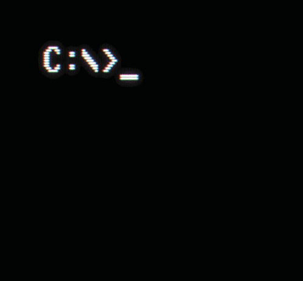

<table>
  <tr>
    <td>
      
    </td>
    <td>
      <h1>👋 Hola, soy Martín Clemente</h1>
      <h3>💻 Estudiante de Técnico en Informática Personal y Profesional</h3>
    </td>
  </tr>
</table>

---

## 👨‍💻 Sobre mí

Soy estudiante de último año de **Técnico en Informática Personal y Profesional**, con interés en el desarrollo de software, tecnologías web, Internet de las Cosas (IoT) y ciberseguridad.

Me interesa transformar ideas en proyectos funcionales, combinando **programación, desarrollo web, hardware y resolución de problemas**.

Actualmente trabajo con tecnologías como **Python, Django, JavaScript, HTML, CSS, SQL, Git y GitHub**, además de desarrollar proyectos relacionados con **ESP32, Arduino e IoT**.

Mi objetivo es continuar desarrollando experiencia mediante proyectos reales, fortalecer mis conocimientos técnicos y seguir creciendo profesionalmente dentro del área de tecnología.

---

## 💻 Lenguajes

## ⚙️ Frameworks

## 🔌 IoT & Hardware

## 🛠️ Herramientas

---

## 📚 Actualmente aprendiendo

* 🐍 Desarrollo avanzado con Python y Django
* 🌐 Desarrollo web
* 🗄️ Bases de datos y SQL
* 📡 Internet de las Cosas (IoT)
* 🤖 Inteligencia Artificial
* 🔐 Ciberseguridad y seguridad de la información
* 🔧 Git y buenas prácticas de desarrollo

---

## 🌐 Conectemos

---

## 📊 Estadísticas de GitHub

  
  

---

